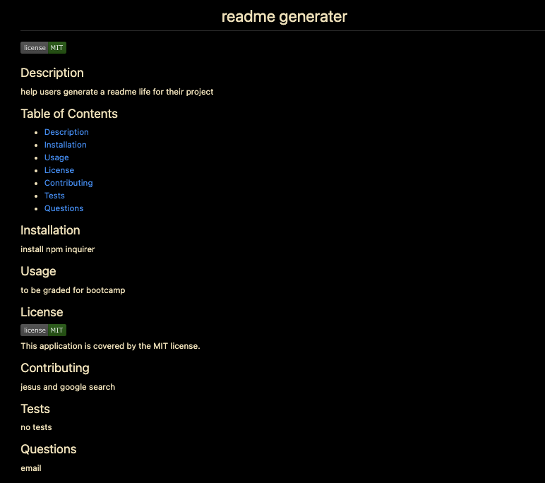

## README HELP! 
   
## DESCRIPTION 
  
A node.js application that uses user input from inquirer to populate a README file for user repository. The README file is created in the dist directory and can be found [HERE](./dist/README.md)  
  
Below is the gif showing the functionality of the application:
  

  
The full movie file showing functionality of the application can be found [HERE](https://drive.google.com/file/d/1WX8jjI8it4rHu4Jq1nxCJndYXJPw9bPS/view?usp=sharing)  
  
## USER STORY
  
```
AS A developer
I WANT a README generator
SO THAT can quickly create a professional README for a new project 
```
  
## ACCEPTANCE CRITERIA  
  
``` 
GIVEN a command-line application that accepts user input
WHEN I am prompted for information about my application repository
THEN a high-quality, professional README.md is generated with the title of my project and sections entitled Description, Table of Contents, Installation, Usage, License, Contributing, Tests, and Questions
WHEN I enter my project title
THEN this is displayed as the title of the README
WHEN I enter a description, installation instructions, usage information, contribution guidelines, and test instructions
THEN this information is added to the sections of the README entitled Description, Installation, Usage, Contributing, and Tests
WHEN I choose a license for my application from a list of options
THEN a badge for that license is added near the top of the README and a notice is added to the section of the README entitled License that explains which license the application is covered under
WHEN I enter my GitHub username
THEN this is added to the section of the README entitled Questions, with a link to my GitHub profile
WHEN I enter my email address
THEN this is added to the section of the README entitled Questions, with instructions on how to reach me with additional questions
WHEN I click on the links in the Table of Contents
THEN I am taken to the corresponding section of the README
```
## MOCK UP 

*The follwoing image shows the web application's appearance and functionality 



## TABLE OF CONTENTS 
- [Description](#description)
- [User Story](#user-story)
- [Acceptance Criteria](#acceptance-criteria)
- [Table of Contents](#table-of-contents)
- [Installation](#installation)
- [Usage](#usage)
- [Contributing](#contributing)
- [Questions](#questions)

## INSTALLATIONS   
`npm init`

`npm install inquirer`
## USAGE    
Run the following command at th root of your project and answer the prompted questions:
  
`node index.js`
## CONTRIBUTING
[Jesus](https://github.com/Jarellano562)

## QUESTIONS 
Contact me with any questions: [EMAIL](mailto:jarellano562.com) , [GITHUB](https://github.com/Jarellano562)<br />

    